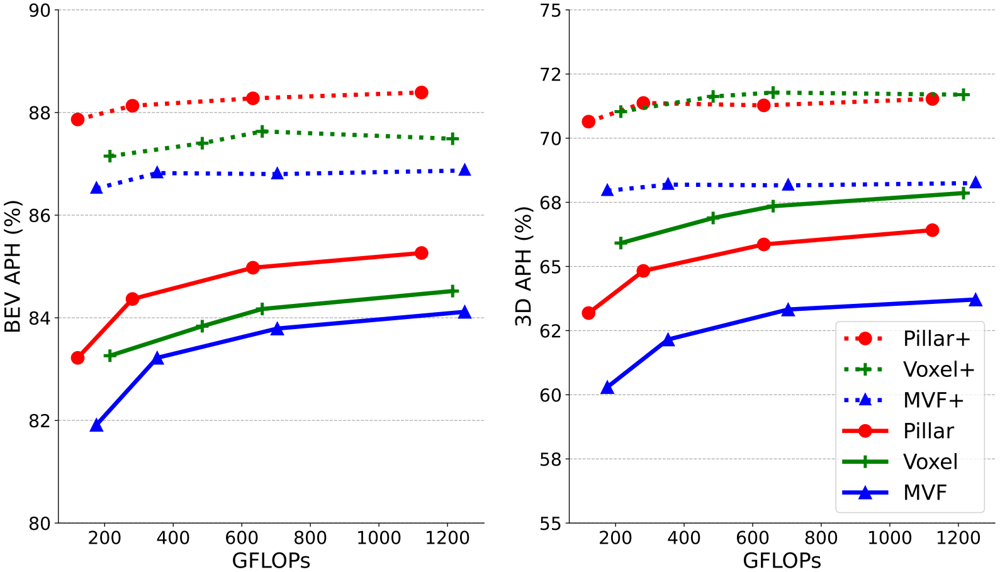

# PillarNeXt: Rethinking Network Designs for 3D Object Detection in LiDAR Point Clouds


[Jinyu Li](https://konstantin5389.github.io/), [Chenxu Luo](https://chenxuluo.github.io/), [Xiaodong Yang](https://xiaodongyang.org/) <br>
PillarNeXt: Rethinking Network Designs for 3D Object Detection in LiDAR Point Clouds, CVPR 2023 <br>
[[Paper]](https://arxiv.org/pdf/2305.04925.pdf) [[Poster]](docs/poster.pdf) 

<p align="left"> 
  
</p>

## Getting Started

### Installation
Please refer to [INSTALL](docs/INSTALL.md) to set up environment and install dependencies (see detail in [Dockerfile](docker/Dockerfile)).

### Data Preparation
Please follow the instructions in [DATA](docs/DATA.md). 

### Training and Evaluation 
Please follow the instructions in [RUN](docs/RUN.md).


## Main Results
### nuScenes (Val)
| Model |  mAP  |  NDS | Checkpoint
| ------| -----| ---- | -------------|
 | PillarNeXt-B | 62.5 | 68.8	| [[Google Drive]](https://drive.google.com/file/d/16abCgt-yhRGnYHQ7M259yGMO0IRYpZ8o/view?usp=drive_link) [[Baidu Cloud]](https://pan.baidu.com/s/1TRsjgN1ys5-mAxM70l4hog?pwd=7skt)

### Waymo Open Dataset 
|Split | #Frames | Veh L2 3D APH | Ped L2 3D APH | Cyc L2 3D APH | 
| ---------| ---------|---------|---------|---------|
| Val | 1 | 69.8 | 69.8 | 69.6 |
| Val | 3 | 72.4 | 75.2 | 75.7 |
| Test| 3 | 75.8 | 76.0 | 70.6 |


## Citation
 Please cite the following paper if this repo helps your research:
```
@inproceedings{li2023pillarnext,
  title={PillarNeXt: Rethinking Network Designs for 3D Object Detection in LiDAR Point Clouds},
  author={Li, Jinyu and Luo, Chenxu and Yang, Xiaodong},
  booktitle={IEEE/CVF Conference on Computer Vision and Pattern Recognition (CVPR)},
  year={2023}
}
```

## Acknowledgement
We thank the authors for the multiple great open-sourced repos, including [Det3D](https://github.com/poodarchu/Det3D), [CenterPoint](https://github.com/tianweiy/CenterPoint) and [OpenPCDet](https://github.com/open-mmlab/OpenPCDet). 

## License
Copyright (C) 2023 QCraft. All rights reserved. Licensed under the [CC BY-NC-SA 4.0](https://creativecommons.org/licenses/by-nc-sa/4.0/legalcode) (Attribution-NonCommercial-ShareAlike 4.0 International). The code is released for academic research use only. For commercial use, please contact [business@qcraft.ai](business@qcraft.ai).
